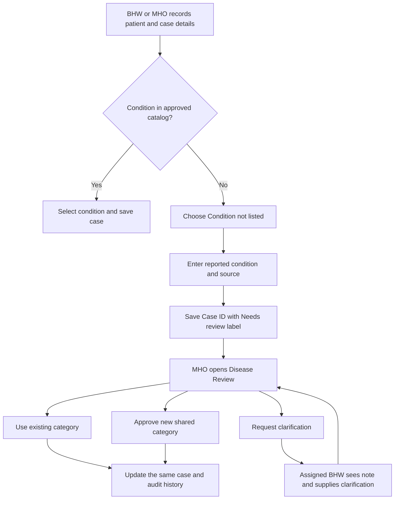

# Disease catalog and classification review

The catalog supplies shared names for patient encoding. It is not limited to the ten categories being considered for prediction. Selecting or reviewing a category records the available medical information; it does not establish a clinical diagnosis.

## Everyday workflow



1. BHW uses **Patient Records → New Record**; MHO uses **Walk-in Patients** and selects the resident's barangay.
2. Search the active catalog. If absent, choose **Condition not listed**, enter the condition as reported and its source (for example a referral or patient report).
3. Saving creates a normal Case ID and resident link, with **Needs review** displayed alongside the original wording. It remains visible in case lists, resident dossiers, maps and case-list exports.
4. MHO opens **Disease Review** and records a note with one of three decisions: use an existing category, approve a new category, or request clarification. The same case/resident ID, severity, date and status remain in place.
5. The assigned BHW sees a clarification note and **Clarify** button. Supplying updated wording/source returns that same case to the review queue. The previous wording is retained in the audit entry.
6. Approved new categories become shared encoding choices when forms reload; MHO's open walk-in form reloads its choices after review. Existing pending cases are not silently remapped in bulk.
7. Admin uses audit **View case #REC-ID** to open the affected Master Record and its linked history. Admin's disease filter follows registry and case names.

Both forms use searchable custom condition dropdowns, keyboard selection and light/dark styling. Severity is a separate case field. New encoding offers active catalog choices only; preserved historical case labels do not become approved choices merely because they exist in imported records.

## Counts, reporting and prediction

Unresolved cases use the aggregate label **Pending classification**, retaining their reported wording and source separately. They contribute to case totals and recorded severity counts, but are not counted under a guessed disease. Maps show the unresolved count; case-list PDFs label the original wording as needing review. Municipal aggregate PDFs use a separate Pending classification category and explain that it is unresolved.

The forecast API refuses Pending classification. Adding a catalog entry does not add it to the prediction selector or validate its training data. The existing demonstration model and datasets were not changed. Forecast eligibility, reviewed data and model validation remain separate work.

New catalog entries retain the current legacy defaults (`morbidity`, `Standard`). These defaults are not official surveillance mappings or ratings of clinical urgency. The official FHSIS/PIDSR definitions, templates and submission process still require MHO review. Urgent reporting uses established MHO channels; a review queue must not delay it. Review turnaround and escalation procedures are operational decisions not implemented here.

## Data and access

The additive migration introduces nullable `health_cases.disease_id` referencing `disease_registry.id`, review state, reported wording/source, review note, reviewer and time. Existing case strings and IDs remain unchanged, with review state Recorded and nullable catalog IDs. No historical mapping is guessed.

New cases and reviews save their audit entry transactionally. Review actions are MHO-only; BHW clarification and patient access stay within the assigned barangay. Stale and concurrent reviews, archived cases and duplicate final classifications are rejected. A failed classification transaction also rolls back a newly proposed registry entry. The audit remains an application log, not an immutable ledger.

## Setup and recovery

From `proposal/server`, with MySQL running, run once on an installation that has not received this migration:

```text
node scripts/apply-disease-review.js --backup ../analysis/disease-review-recovery/new-private-backup.sql
```

Choose an unused private backup filename. The script saves a full SQL dump before adding columns/index/foreign key, checks that original case fields remain unchanged, and refuses to overwrite a backup. It does not merge, relink or delete cases. DDL is additive and repeatable; if interrupted, preserve the backup, inspect the error and rerun with another unused backup path.

Restart the backend with `npm start`, then refresh BHW, MHO and Admin browser tabs. This migration does not run automatically at server startup.

The local recovery tag **pre-disease-review-20260930** is commit `afc52f5`. The new feature is saved in a separate local commit. Preserve later work, then run `git revert disease-review-20260930` if required; restart and refresh afterward. Reverting code keeps database columns and saved cases. Older code cannot manage the new review workflow, so pending cases need an explicit recovery plan before using it for further encoding. Do not drop new columns or restore a full SQL backup over newer patient records without reviewing what would be lost.

Private dumps are under ignored `analysis/disease-review-recovery/`. Never commit or share them. This work does not push to GitHub.

## Verification

Run `npm test` in `server/`. The full suite has 62 checks. Review coverage uses a schema-only temporary database and synthetic accounts/cases, checks stable identity, unlisted validation, pending map totals, MHO permissions, clarification scope, stale/concurrent decisions, duplicates and transaction rollback. Other suites cover existing role flows, PDFs, backup restoration and session handling.

Disposable browser QA verified BHW and MHO unlisted encoding, resident visibility, clarification round trip, new-category approval, mapping to an existing category, refreshed choices, dynamic Admin filtering and audit-to-case history. Search, keyboard selection and light/dark dropdown appearance were checked. Source fingerprints were unchanged after the disposable browser database and servers were removed. Test results do not establish official reporting compliance or clinical validity.
